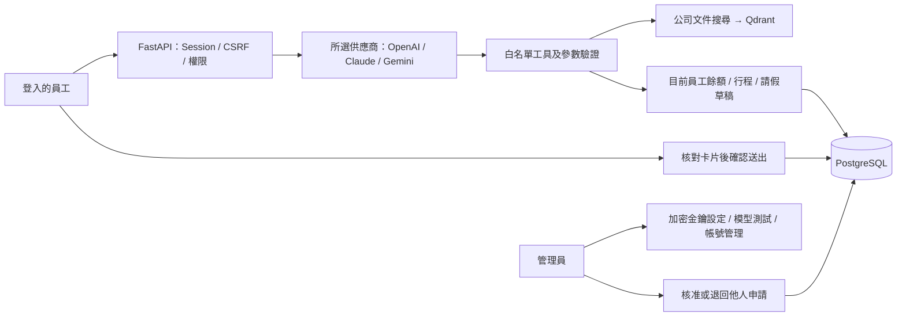

# 日常 Daywork · 企業 AI 行政助理

一個可部署於單一組織的行政工作台：登入後查詢公司文件、個人假期、行程與建立請假；管理員設定 AI 模型、帳號與審核申請。前端不需 Node build 或外部 CDN。


**Cloudflare Demo**：新增 Workers + D1 版本，網站、API 與持久資料全部在 Cloudflare，保留三家 AI 與離線規則展示。請依 [CLOUDFLARE.md](CLOUDFLARE.md) 建立 D1、設定 Secrets 與部署。Cloudflare 工具鏈需要 Node；下方快速開始與安全實作說明適用 Python 版本，兩者資料不互通。

**展示完善**：引用可定位原文段落並提示版本變更；獨立審核工作台提供待辦數、搜尋、核准／退回紀錄；個人行程可新增、編輯、刪除，並由助理查詢。見 [DEMO.md](DEMO.md)。

## 快速開始

Python 3.12+，在專案根目錄執行：

```powershell
./start.ps1 -InstallDependencies
```

已安裝套件時可用 `./start.ps1`。瀏覽 http://127.0.0.1:8000 。首次使用需建立管理員，沒有預設密碼。在另一個終端執行以下指令，將代碼填入初始化頁面：

```powershell
.\.venv\Scripts\python.exe -m app.manage setup-code
```

輸入姓名、帳號及至少 12 字元密碼。登入後到 **管理設定 → 連接一個 AI 模型**，填入供應商、模型 ID 與 API Key，依序 **加密儲存 → 測試連線 → 啟用 → 設為預設**。

完整逐步說明見 [USER_GUIDE.md](USER_GUIDE.md)。正式部署見 [DEPLOYMENT.md](DEPLOYMENT.md)。

## 已實作

- OpenAI Responses、Anthropic Claude Messages、Google Gemini OpenAI 相容介面。可儲存多個供應商／模型設定，員工可選擇已啟用的模型。
- Argon2id 密碼雜湊、伺服器 Session、HttpOnly／SameSite Cookie、正式環境 Secure Cookie、Origin 與 CSRF 檢查。
- 管理員／員工角色，員工資料依登入身分隔離；API、工具都不能指定他人身分。管理員有全組織待審請假權限，請只交付給授權的人資／行政人員。
- API Key 使用 Fernet 加密，列表只回傳末四碼遮罩；不把金鑰交給員工、寫進瀏覽器儲存或工具對話。管理操作留紀錄，錯誤不回傳供應商原始內容或輸入密鑰。
- 初始化代碼、帳號建立／停用、修改密碼與伺服器端密碼復原。停用帳號或改密碼會撤銷既有登入。
- 文件搜尋、來源引用、假期餘額、請假草稿、明確送出、取消／撤回、管理員核准／退回及逐筆紀錄。
- 請假餘額與狀態在交易內更新；重複送出／撤回／審核不重複扣還額度。管理員不能自審。
- 對話保留、歷史切換、UUID 冪等重試；瀏覽器只使用分頁 sessionStorage 保存對話定位與待重試請求，登出清除。
- 登入／聊天／模型測試限流，請求大小限制；每次 AI 最多 6 輪、8 次工具呼叫、每次輸出上限 2048 tokens，以及時間上限。
- PostgreSQL、Qdrant 與 Caddy HTTPS 的正式 Compose；正式模式缺少必要安全設定時拒絕啟動，未設定 AI 時拒絕聊天，不退回離線規則。

## 三種供應商，共用四個工具



模型只能呼叫 `search_company_knowledge`、`get_leave_balance`、`create_leave_request`、`get_calendar_events`。不能直接執行 SQL、送出請假、審核申請或管理金鑰。AI 可能回答錯誤，因此回覆附工具紀錄及文件來源，具影響的操作由人確認。

串接依據：[OpenAI Function Calling](https://developers.openai.com/api/docs/guides/function-calling)、[Claude Tool Calls](https://platform.claude.com/docs/en/agents-and-tools/tool-use/handle-tool-calls)、[Gemini OpenAI Compatibility](https://ai.google.dev/gemini-api/docs/openai)。模型 ID 由管理員填寫；是否可用取決於供應商、帳戶權限及工具支援，必須實測通過才可啟用。

## 聊天模型與文件檢索分開設定

`AGENT_MODE=demo` 是本機尚未設定任何 AI 時的離線規則備援，不影響管理介面啟用的模型。正式環境只接受管理介面設定的 AI。舊版 `AGENT_MODE=openai` 僅保留本機相容性，不建議再使用。

`EMBEDDING_MODE=local` 預設使用 512 維字元 bigram 雜湊向量與詞片重排，無外部嵌入費用；**它是詞彙檢索，不等同語意 Embedding**。三家聊天模型均可使用此檢索結果。

要啟用語意檢索，由部署者在環境中設定：

```dotenv
EMBEDDING_MODE=openai
OPENAI_API_KEY=你的嵌入專用金鑰
EMBEDDING_MODEL=text-embedding-3-small
```

之後重新啟動服務。此金鑰和介面上的聊天 Key 分開管理，文件內容與搜尋問題會送往 OpenAI 生成向量；聊天仍可選 Claude 或 Gemini。索引依嵌入模型分開，不會混用不同向量。

## 文件與資料

本機首次啟動保留原有示範資料，或建立 10 位虛構員工及 6 份虛構政策。第一位本機管理員綁定 E001；其他示範員工沒有登入憑證。新增真實帳號使用新的員工編號，初始額度由管理員輸入。正式模式不建立任何示範員工，且必須使用獨立的公司文件目錄。

`.md`、`.txt` 和可選取文字的 `.pdf` 放在 `KNOWLEDGE_DIR`，重啟服務索引；掃描 PDF 先 OCR。索引先建立新 collection 再切換 alias。舊 collection 保留，需部署者定期清理。嵌入式 Qdrant 必須停止 app 才能另跑 `python -m app.ingest`。

此次資料庫變更只新增帳號、Session、模型設定、管理事件及審核資料表，保留既有請假與對話。以 `create_all` 建立缺少的表，**不是通用 schema migration 系統**；未來若變更既有欄位，必須編寫並驗證明確 migration，不能只依賴 ORM。

## 程式結構

| 路徑 | 功能 |
|---|---|
| `app/main.py` | API、登入 middleware、個人資料、聊天交易 |
| `app/security.py` | 密碼、Session、金鑰加密與限流 |
| `app/admin.py` | 初始化、登入、模型與帳號管理、請假審核 |
| `app/providers.py` | 三家供應商 adapter 與工具往返測試 |
| `app/agent.py` | 共用工具、AI 迴圈與離線規則 |
| `app/leave_service.py` | 請假與額度交易驗證 |
| `app/rag.py` | 文件擷取、切塊、索引與搜尋 |
| `app/manage.py` | 初始化代碼、產生加密金鑰、密碼復原 |
| `static/` | 登入、管理設定及工作台 UI |
| `tests/` | 功能、安全、供應商協定與選用服務測試 |

## 驗證與適用範圍

```powershell
.\.venv\Scripts\python.exe -m pytest -q -o addopts=''
node --check static/app.js
node --check static/settings.js
docker compose config --quiet
.\.venv\Scripts\python.exe -m app.doctor --url http://127.0.0.1:8000
```

測試覆蓋登入、CSRF、角色與員工隔離、加密遮罩、Key 輪替、模型啟用門檻、供應商工具往返協定、請假併發與冪等，以及原有 RAG／對話行為。供應商協定使用 mock HTTP，不代表真實 Key／模型連線已通過。

PostgreSQL + Qdrant server 的測試僅在 `RUN_SERVICE_TESTS=1` 且指向拋棄式服務時執行。GitHub Actions 配有 Windows／Linux 與服務測試，但本次沒有遠端 CI 執行結果。

目前定位是**單一組織、單一 app instance／worker 的小型部署**，全域聊天鎖限制同時一個 AI 任務。多租戶、SSO／MFA、跨實例分散式限流與任務鎖、大型組織分級核決、HRIS／Google Calendar 同步、假期到期及自動年度給假都尚未實作。上線前必須確認固定工作時段、請假規則及資料處理範圍符合實際組織制度；詳見部署文件。
